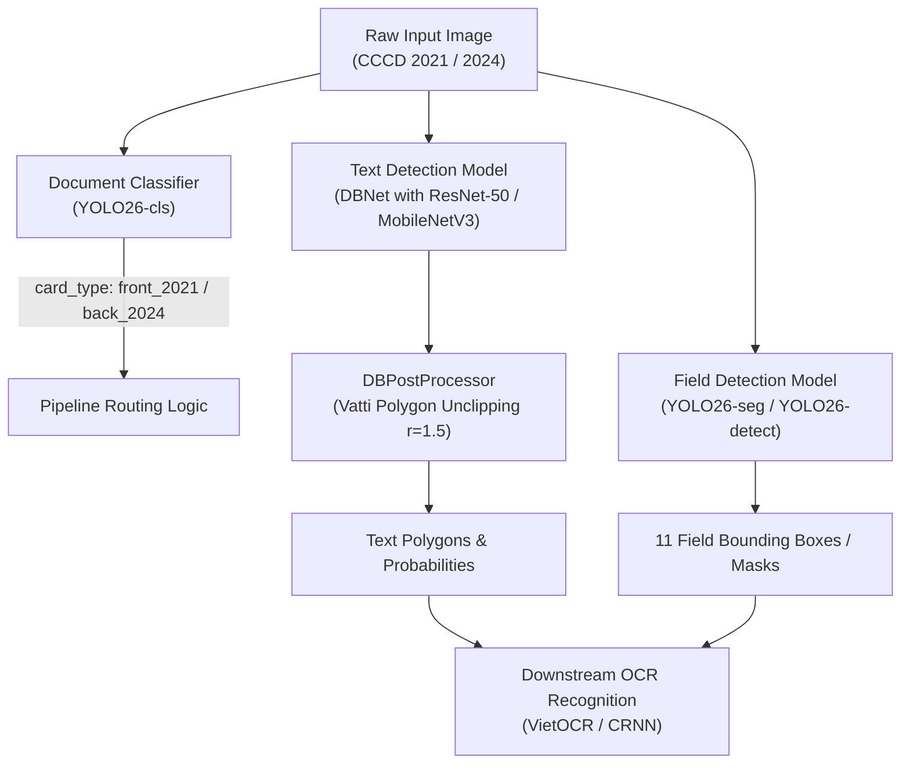

# Vietnamese ID Card (CCCD) Text Detection & Classification Pipeline

[](https://www.python.org/downloads/)
[](https://pytorch.org/)
[](https://github.com/ultralytics/ultralytics)
[](https://github.com/astral-sh/uv)
[]()

A high-performance, modular, and production-ready **Text Detection and Document Classification Framework** specifically tailored for Vietnamese Citizen Identity Cards (**CCCD 2021 chip** and **CCCD 2024** standards). Built with modern deep learning backbones (**DBNet**, **YOLO26-cls**, **YOLO26-seg**), Automatic Mixed Precision (AMP FP16), and the standard **ICDAR 2015 Evaluation Protocol**.

---

## 🏛️ System Architecture



---

## ✨ Key Features

- **Modular Registry Pattern:** Dynamic component management for `BACKBONES`, `NECKS`, `HEADS`, `LOSSES`, `POSTPROCESSORS`, and `METRICS`.
- **Differentiable Binarization (DBNet):**
  - **Differentiable Binarization Step Function:** $\hat{B}_{i,j} = \frac{1}{1 + e^{-k(P_{i,j} - T_{i,j})}}$ with amplification factor $k=50$.
  - **Multi-Task DBLoss:** Hard Negative Mining (OHEM 1:3) Binary Cross-Entropy + Smooth L1 Threshold Loss + Dice Loss.
  - **Vatti Unclipping Algorithm:** Restores original polygon contours using `pyclipper` polygon expansion ($r'=1.5$).
- **Lean Document Classifier (YOLO26-cls):**
  - Instant classification of card standard (`2021` vs `2024`) and side (`front` vs `back`).
  - Zero-disk-duplication dynamic Train/Val staging via in-memory symbolic links (`scratch/yolo_cls/`).
  - High-throughput vectorized batch inference (`classify_batch`).
  - 1-Line export to ONNX / TensorRT (`export(format="onnx", half=True)`).
- **Production Training Engine:**
  - Automatic Mixed Precision (**AMP FP16**) on CUDA and Apple Silicon (**MPS**).
  - Cosine Annealing Learning Rate scheduler with 3-epoch Linear Warmup.
  - Gradient norm clipping (`max_norm=5.0`) for numerical stability.
  - Periodic and auto-best checkpoint saving based on validation **Hmean (F1-score)**.
  - Full checkpoint resume support (`--resume`).
  - Interactive, real-time progress logging powered by `tqdm` and `rich`.
- **ICDAR 2015 Benchmark Metrics:**
  - Automated Polygon IoU matching ($\ge 0.5$) with `shapely`.
  - Full support for `ignore_tags` to prevent penalizing unreadable text regions.
  - Detailed reporting of Precision, Recall, Hmean, Latency (ms), and FPS.

---

## 📁 Repository Structure

```
text_detection/
├── configs/                          # Experiment configuration files
│   ├── dbnet/
│   │   └── dbnet.yaml                # Master DBNet configuration (ResNet-50 / MobileNetV3)
│   └── yolo/
│       ├── yolo.yaml                 # YOLO Bounding Box Detection configuration
│       ├── yolo_cls.yaml             # YOLO Document Classification configuration
│       └── yolo_seg.yaml             # YOLO Instance Segmentation (11 fields) configuration
├── data/                             # Dataset storage
│   ├── images/                       # Real CCCD images (640x640)
│   └── labels/
│       ├── dbnet/dataset.jsonl       # Master DBNet JSONL annotations
│       ├── yolo_detect/              # YOLO Bounding Box labels
│       └── yolo_seg/                 # YOLO Segmentation labels
├── docs/                             # Technical documentation and architecture diagrams
│   ├── dbnet.md                      # Comprehensive DBNet technical specification
│   └── images/                       # High-resolution architectural diagrams
├── src/                              # Core framework source code
│   ├── data/                         # Data loaders, target generators, and transforms
│   ├── engine/                       # Training loop, AMP, and checkpointing
│   ├── losses/                       # DBLoss, BCE with OHEM 1:3, Dice Loss, Smooth L1
│   ├── metrics/                      # ICDAR 2015 Evaluator & Polygon IoU
│   ├── models/                       # Model Zoo (Backbones, Necks, Heads, Detectors)
│   │   ├── backbones/                # ResNet, MobileNetV3, TIMMBackbone
│   │   ├── necks/                    # FPN, Adaptive Scale Fusion (ASF)
│   │   ├── heads/                    # DBHead
│   │   ├── detectors/                # DBNet assembly
│   │   └── wrappers/                 # YOLOClassifier & YOLOWrapper
│   ├── postprocess/                  # DBPostProcessor & Vatti Unclipping
│   └── utils/                        # Config loader, Registry, Logger, Checkpoint helpers
├── tools/                            # 1-Click Command-Line Tools
│   ├── train.py                      # DBNet training CLI
│   ├── eval.py                       # DBNet ICDAR 2015 evaluation CLI
│   ├── demo.py                       # DBNet inference & polygon visualization CLI
│   ├── train_yolo.py                 # YOLO Field Detection / Segmentation training CLI
│   ├── train_yolo_cls.py             # YOLO Document Classification training CLI
│   ├── eval_yolo_cls.py              # YOLO Document Classification evaluation CLI
│   └── predict_yolo_cls.py           # YOLO Document Classification inference CLI
├── weights/                          # Pretrained & Best production weights
│   ├── dbnet/dbnet_cccd_best.pth     # Production DBNet weights
│   └── yolo/                         # Base & fine-tuned YOLO weights
├── tests/                            # Comprehensive Unit Test Suite (39/39 passing)
├── pyproject.toml                    # PEP 517 / PEP 621 package build configuration
└── README.md
```

---

## ⚡ Quick Start

### 1. Installation

The project uses [`uv`](https://github.com/astral-sh/uv) for fast, reproducible dependency management and editable package installation:

```bash
# Clone the repository
git clone https://github.com/stevexle/text-detection.git
cd text-detection

# Synchronize virtual environment dependencies
uv sync

# Install package in editable mode
uv pip install -e .

# Run the complete test suite (39 unit tests)
uv run pytest
```

### 2. Download Pretrained Base Weights (1-Click)

Run the automated script to download ImageNet backbones (ResNet-50/18, MobileNetV3) and YOLO base models directly into `weights/`:

```bash
# On Linux / macOS server:
bash scripts/download_weights.sh
```

---

## 🚀 Execution & Usage

### Module 1: Document Classification (YOLO26-cls)

Classifies identity cards into 4 distinct classes: `front_2021`, `back_2021`, `front_2024`, `back_2024`.

#### Train Classifier:
```bash
uv run python tools/train_yolo_cls.py --config configs/yolo/yolo_cls.yaml --epochs 30 --batch-size 32
```
*Automatically splits `dataset.jsonl` dynamically into 85% Train / 15% Val using symbolic links in `scratch/yolo_cls/`.*

#### Evaluate Classifier:
```bash
uv run python tools/eval_yolo_cls.py --config configs/yolo/yolo_cls.yaml
```

#### Run Classification Inference:
```bash
uv run python tools/predict_yolo_cls.py --weights weights/yolo/yolo26_cls_best.pt --source data/images/sample.jpg --save-json output.json
```

**Structured JSON Output:**
```json
{
  "card_type": "front_2021",
  "confidence": 0.9982
}
```

---

### Module 2: Text Detection (DBNet)

Detects tight text polygon contours across the identity card.

#### Train DBNet:
```bash
uv run python tools/train.py --config configs/dbnet/dbnet.yaml --epochs 50 --batch-size 8 --lr 0.0005
```

#### Resume Training from Checkpoint:
```bash
uv run python tools/train.py --config configs/dbnet/dbnet.yaml --resume work_dirs/dbnet/latest.pth
```

#### Benchmark Evaluation (ICDAR 2015 Protocol):
```bash
uv run python tools/eval.py --config configs/dbnet/dbnet.yaml --weights weights/dbnet/dbnet_cccd_best.pth --iou-thresh 0.5
```
*Outputs Precision, Recall, Hmean (F1-score), Latency (ms), and FPS.*

#### Run Inference & Polygon Visualization:
```bash
uv run python tools/demo.py --source data/images/sample.jpg --output-dir runs/predict/ --save-json polygons.json
```
*Draws high-visibility polygon overlays and confidence badges, saving visualized outputs to `runs/predict/pred_sample.jpg`.*

**Unified Detection JSON Output (DBNet):**
```json
[
  {
    "label": "text",
    "confidence": 0.9842,
    "polygon": [[214.25, 279.25], [379.75, 279.25], [379.75, 311.75], [214.25, 311.75]]
  },
  {
    "label": "text",
    "confidence": 0.9615,
    "polygon": [[214.75, 346.00], [348.25, 346.00], [348.25, 381.00], [214.75, 381.00]]
  }
]
```

---

### Module 3: Field Detection & Segmentation (YOLO26-seg)

Detects and segments the 11 standardized CCCD information fields: `id`, `name`, `dob`, `gender`, `nationality`, `origin_place`, `current_place`, `expire_date`, `issue_date`, `features`, `mrz`.

#### Train YOLO Field Segmentation:
```bash
uv run python tools/train_yolo.py --config configs/yolo/yolo_seg.yaml --epochs 50 --batch-size 16 --imgsz 640
```

**Unified Detection JSON Output (YOLO Field Segmentation):**
```json
[
  {
    "label": "id",
    "confidence": 0.9785,
    "polygon": [[214.00, 279.00], [380.00, 279.00], [380.00, 312.00], [214.00, 312.00]]
  },
  {
    "label": "name",
    "confidence": 0.9654,
    "polygon": [[214.00, 346.00], [348.00, 346.00], [348.00, 381.00], [214.00, 381.00]]
  },
  {
    "label": "current_place",
    "confidence": 0.9410,
    "polygon": [[74.00, 138.00], [278.00, 138.00], [278.00, 164.00], [74.00, 164.00]]
  }
]
```

---

## 🧪 Verification & Unit Tests

The test suite ensures 100% reliability across all core components:

```bash
uv run pytest -v
```

```text
============================== 39 passed in 3.82s ==============================
tests/test_classifier.py ........                                        [ 20%]
tests/test_data.py ...                                                   [ 28%]
tests/test_engine.py ...                                                 [ 35%]
tests/test_losses.py ....                                                [ 46%]
tests/test_metrics.py .......                                            [ 64%]
tests/test_models.py .......                                             [ 82%]
tests/test_postprocess.py ...                                            [ 89%]
tests/test_utils.py ....                                                 [100%]
```

---

## 📖 Technical Documentation

For detailed mathematical formulations, ablation studies, loss curves, and architectural deep-dives, please refer to:
* [DBNet Technical Master Documentation](docs/dbnet.md)

---

## 📄 License

This project is licensed under the Apache 2.0 License.
