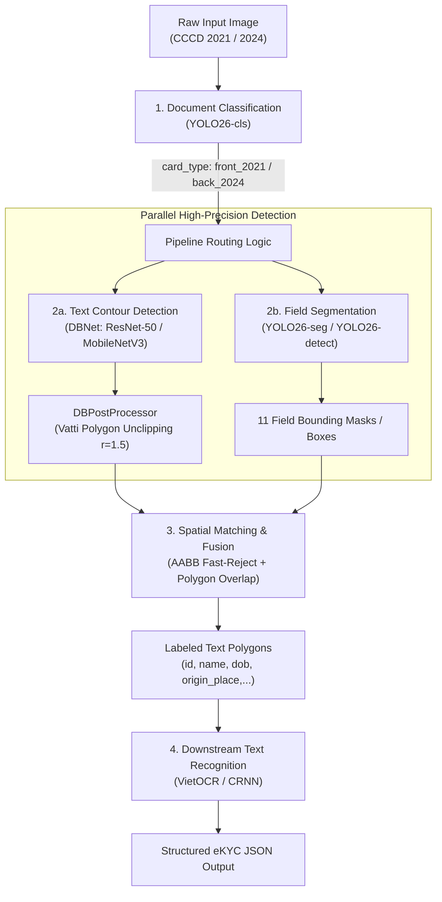

# Vietnamese ID Card (CCCD) Text Detection & Classification Pipeline

[](https://www.python.org/downloads/)
[](https://pytorch.org/)
[](https://github.com/ultralytics/ultralytics)
[](https://onnxruntime.ai/)
[](https://github.com/astral-sh/uv)
[]()

A high-performance, modular, and production-ready **Text Detection, Field Segmentation, and Document Classification Framework** specifically tailored for Vietnamese Citizen Identity Cards (**CCCD 2021 chip** and **CCCD 2024** standards). Built with modern deep learning backbones (**DBNet**, **YOLO26-cls**, **YOLO26-seg**), Spatial Matching Hybrid Fusion, pure C++ **ONNX Runtime** deployment, and the standard **ICDAR 2015 Evaluation Protocol**.

---

## 🏛️ System Architecture



---

## ✨ Key Features

- **Modular Registry Pattern:** Dynamic component management for `BACKBONES`, `NECKS`, `HEADS`, `LOSSES`, `POSTPROCESSORS`, and `METRICS`.
- **Differentiable Binarization (DBNet):**
  - **Differentiable Binarization Step Function:** $\hat{B}_{i,j} = \frac{1}{1 + e^{-k(P_{i,j} - T_{i,j})}}$ with amplification factor $k=50$.
  - **Multi-Task DBLoss:** Hard Negative Mining (OHEM 1:3) Binary Cross-Entropy + Smooth L1 Threshold Loss + Dice Loss.
  - **Vatti Unclipping Algorithm:** Restores original polygon contours using `pyclipper` polygon expansion ($r'=1.5$).
- **Lean Document Classifier (YOLO26-cls):**
  - Instant classification of card standard (`2021` vs `2024`) and side (`front` vs `back`).
  - Zero-disk-duplication dynamic Train/Val staging via in-memory symbolic links (`scratch/yolo_cls/`).
  - High-throughput vectorized batch inference (`classify_batch`).
  - 1-Line export to ONNX / TensorRT (`export(format="onnx", half=True)`).
- **Semantic Field Segmentation (YOLO26-seg):**
  - Segments 11 standardized CCCD information fields: `id`, `name`, `dob`, `gender`, `nationality`, `origin_place`, `current_place`, `expire_date`, `issue_date`, `features`, `mrz`.
  - Dynamic in-memory Train/Val staging via symlinks (`scratch/yolo_seg/`).
- **High-Speed Spatial Matching Hybrid Pipeline:**
  - Fast AABB (Axis-Aligned Bounding Box) filtering + Shapely polygon intersection.
  - Automatically maps semantic field labels (`name`, `id`, `dob`,...) to sharp DBNet character polygon contours.
  - Guaranteed Zero-Lost-Field fallback mechanism (`min_conf=0.25`).
  - GPU/JIT Warmup & `torch.inference_mode()` execution (~40-50 ms / card).
- **Pure ONNX Runtime Production Pipeline:**
  - 3-Way Concurrent multi-threaded execution (`ThreadPoolExecutor(max_workers=3)`) releasing Python GIL during native C++ inference.
  - Precomputed Fused Multiply-Add Normalization (`img * scale + bias`) and zero-copy contiguous memory buffers.
  - Fast NMS pruning (`max_det=30`, `retina_masks=False`, `imgsz=224`) saving 15-30 ms per card.
  - True Vectorized Batched Inference (`predict_batch`) executing single-pass tensor batches `(B, 3, H, W)`.
  - Hardware Execution Providers: `CoreMLExecutionProvider` (Apple Silicon Neural Engine) & `CUDAExecutionProvider` (NVIDIA GPU).
  - AsyncIO Integration (`predict_async`, `predict_batch_async`) for non-blocking FastAPI / web services.
- **Production Training Engine:**
  - Automatic Mixed Precision (**AMP FP16**) on CUDA and Apple Silicon (**MPS**).
  - Cosine Annealing Learning Rate scheduler with 3-epoch Linear Warmup.
  - Gradient norm clipping (`max_norm=5.0`) for numerical stability.
  - Periodic and auto-best checkpoint saving based on validation **Hmean (F1-score)**.

---

## 📁 Repository Structure

```
text_detection/
├── configs/                          # Experiment configuration files
│   ├── dbnet/
│   │   └── dbnet.yaml                # Master DBNet configuration (ResNet-50 / MobileNetV3)
│   └── yolo/
│       ├── yolo.yaml                 # YOLO Bounding Box Detection configuration
│       ├── yolo_cls.yaml             # YOLO Document Classification configuration
│       └── yolo_seg.yaml             # YOLO Instance Segmentation (11 fields) configuration
├── data/                             # Dataset storage
│   ├── images/                       # Real CCCD images (640x640)
│   └── labels/
│       ├── dbnet/dataset.jsonl       # Master DBNet JSONL annotations
│       ├── yolo_detect/              # YOLO Bounding Box labels
│       └── yolo_seg/                 # YOLO Segmentation labels
├── docs/                             # Technical documentation and architecture diagrams
│   ├── dbnet.md                      # Comprehensive DBNet technical specification
│   └── images/                       # High-resolution architectural diagrams
├── src/                              # Core framework source code
│   ├── data/                         # Data loaders, target generators, and transforms
│   ├── engine/                       # Training loop, AMP, and checkpointing
│   ├── losses/                       # DBLoss, BCE with OHEM 1:3, Dice Loss, Smooth L1
│   ├── metrics/                      # ICDAR 2015 Evaluator & Polygon IoU
│   ├── models/                       # Model Zoo (Backbones, Necks, Heads, Detectors)
│   │   ├── backbones/                # ResNet, MobileNetV3, TIMMBackbone
│   │   ├── necks/                    # FPN, Adaptive Scale Fusion (ASF)
│   │   ├── heads/                    # DBHead
│   │   ├── detectors/                # DBNet assembly
│   │   └── wrappers/                 # YOLOClassifier & YOLOWrapper
│   ├── pipeline/                     # End-to-End Hybrid Processing Pipeline
│   │   ├── spatial_matcher.py        # AABB & Polygon Overlap Matching with Fallback
│   │   ├── cccd_pipeline.py          # Unified eKYC CCCD Detection Pipeline (PyTorch)
│   │   └── cccd_pipeline_onnx.py     # Pure ONNX Runtime High-Performance Pipeline
│   ├── postprocess/                  # DBPostProcessor & Vatti Unclipping
│   └── utils/                        # Config loader, Registry, Logger, Checkpoint helpers
├── tools/                            # 1-Click Command-Line Tools
│   ├── train.py                      # DBNet training CLI
│   ├── eval.py                       # DBNet ICDAR 2015 evaluation CLI
│   ├── demo.py                       # DBNet inference & polygon visualization CLI
│   ├── train_yolo.py                 # YOLO Field Detection / Segmentation training CLI
│   ├── eval_yolo.py                  # YOLO Detection / Segmentation evaluation CLI
│   ├── predict_yolo_pipeline.py      # Pure YOLO End-to-End Pipeline (Classification + Field Segmentation)
│   ├── train_yolo_cls.py             # YOLO Document Classification training CLI
│   ├── eval_yolo_cls.py              # YOLO Document Classification evaluation CLI
│   ├── predict_yolo_cls.py           # YOLO Document Classification inference CLI
│   ├── predict_pipeline.py           # 1-Click Hybrid Pipeline (PyTorch DBNet + YOLO)
│   ├── predict_pipeline_onnx.py      # Pure ONNX Runtime Pipeline CLI (Concurrent 3-way)
│   ├── benchmark_performance.py      # Stress testing & multi-worker pipeline benchmark CLI
│   └── export_onnx.py                # Production ONNX Exporter (DBNet, YOLO-seg, YOLO-cls)
├── weights/                          # Pretrained & Best production weights
│   ├── dbnet/dbnet_cccd_best.pth     # Production DBNet weights
│   ├── yolo/                         # Base & fine-tuned YOLO weights
│   └── onnx/                         # Optimized self-contained ONNX models
│       ├── dbnet.onnx                # DBNet dynamic spatial & batch ONNX (~96 MB)
│       ├── yolo26_seg.onnx           # YOLO-seg dynamic ONNX (~11 MB)
│       └── yolo26_cls.onnx           # YOLO-cls dynamic ONNX (~6 MB)
├── tests/                            # Comprehensive Unit Test Suite (48/48 passing)
│   ├── test_pipeline_onnx.py         # Unit tests for Pure ONNX Pipeline (sync, async, batch)
│   └── test_export_onnx.py           # Unit tests for ONNX Export & Dynamic Shape Verification
├── pyproject.toml                    # PEP 517 / PEP 621 package build configuration
└── README.md
```

---

## ⚡ Quick Start

### 1. Installation

The project uses [`uv`](https://github.com/astral-sh/uv) for fast, reproducible dependency management and editable package installation:

```bash
# Clone the repository
git clone https://github.com/stevexle/text-detection.git
cd text-detection

# Synchronize virtual environment dependencies
uv sync

# Install package in editable mode
uv pip install -e .

# Run the complete test suite (48 unit tests)
uv run pytest
```

### 2. Download Pretrained Base Weights (1-Click)

Run the automated script to download ImageNet backbones (ResNet-50/18, MobileNetV3) and YOLO base models directly into `weights/`:

```bash
# On Linux / macOS server:
bash scripts/download_weights.sh
```

### 3. 🚀 Quick Run with ONNX Runtime (Fastest 1-Click Demo)

Run the complete end-to-end detection pipeline (Document Classification + 11 Field Segmentations + DBNet Text Contours + Spatial Matching) purely on **ONNX Runtime**:

```bash
# 1-Click predict and visualize with ONNX Runtime:
uv run python tools/predict_pipeline_onnx.py \
  --source data/quanganh-f.jpg \
  --save-vis runs/pipeline_onnx/
```

* **Hardware Acceleration:** Auto-selects `CoreMLExecutionProvider` on Apple Silicon (159/181 nodes accelerated) or `CUDAExecutionProvider` on NVIDIA GPU.
* **Output JSON:** Saved to `runs/pipeline_onnx/result.json`.
* **Output Visualization:** Colored polygon badges saved to `runs/pipeline_onnx/onnx_fused_quanganh-f.jpg`.

---

## 🚀 Execution & Usage

### Module 1: Document Classification (YOLO26-cls)

Classifies identity cards into 4 distinct classes: `front_2021`, `back_2021`, `front_2024`, `back_2024`.

#### Train Classifier:
```bash
uv run python tools/train_yolo_cls.py --config configs/yolo/yolo_cls.yaml --epochs 30 --batch-size 32
```

#### Evaluate Classifier:
```bash
uv run python tools/eval_yolo_cls.py --config configs/yolo/yolo_cls.yaml
```

#### Run Classification Inference (PyTorch & ONNX):
```bash
# PyTorch inference:
uv run python tools/predict_yolo_cls.py --weights weights/yolo/yolo26_cls_best.pt --source data/images/sample.jpg --save-json output.json

# ONNX Runtime inference:
uv run yolo predict model=weights/onnx/yolo26_cls.onnx source=data/quanganh-f.jpg
```

---

### Module 2: Text Detection (DBNet)

Detects tight text polygon contours across the identity card.

#### Train DBNet:
```bash
uv run python tools/train.py --config configs/dbnet/dbnet.yaml --epochs 50 --batch-size 8 --lr 0.0005
```

#### Benchmark Evaluation (ICDAR 2015 Protocol):
```bash
uv run python tools/eval.py --config configs/dbnet/dbnet.yaml --weights weights/dbnet/dbnet_cccd_best.pth --iou-thresh 0.5
```

#### Run Inference & Polygon Visualization:
```bash
uv run python tools/demo.py --source data/images/sample.jpg --output-dir runs/predict/ --save-json polygons.json
```

---

### Module 3: Field Detection & Pure YOLO Pipeline (YOLO26-seg)

Detects and segments the 11 standardized CCCD information fields: `id`, `name`, `dob`, `gender`, `nationality`, `origin_place`, `current_place`, `expire_date`, `issue_date`, `features`, `mrz`.

#### Train YOLO Field Segmentation:
```bash
uv run python tools/train_yolo.py --config configs/yolo/yolo_seg.yaml --epochs 50 --batch-size 16 --imgsz 640
```

#### Run Pure YOLO End-to-End Prediction:
```bash
# PyTorch pipeline:
uv run python tools/predict_yolo_pipeline.py --source data/cccd-minh2.jpg --save-vis runs/predict_yolo/

# Direct ONNX Runtime YOLO-seg inference:
uv run yolo predict model=weights/onnx/yolo26_seg.onnx source=data/quanganh-f.jpg
```

---

### Module 4: 🚀 Pure ONNX Runtime High-Throughput Pipeline (Production-Ready)

Production pipeline executing entirely on **ONNX Runtime C++ Engine** without PyTorch inference overhead.

#### Key Architectural Optimizations:
1. **3-Way Concurrent Multi-threading:** Executes DBNet, YOLO-seg, and YOLO-cls in parallel threads (`ThreadPoolExecutor(max_workers=3)`), releasing Python GIL.
2. **Fused Multiply-Add Normalization:** Precomputed `scale` and `bias` fuses `/255.0`, `-mean`, and `/std` into a single vectorized arithmetic operation.
3. **Zero-Copy Memory Layout:** `np.ascontiguousarray` prevents memory re-allocations when passing image tensors to ONNX Runtime C++.
4. **Fast NMS Pruning:** Constrains `max_det=30` and `retina_masks=False` to eliminate redundant mask upscaling.
5. **True Vectorized Batching:** `predict_batch` constructs `(B, 3, H, W)` batch tensors and runs a single forward pass through the ONNX engine.
6. **Hardware Acceleration:** Auto-selects `CoreMLExecutionProvider` on Apple Silicon (159/181 nodes accelerated) or `CUDAExecutionProvider` on NVIDIA GPU.

#### 1-Click CLI Inference:
```bash
# Single image with color-coded polygon badge visualization:
uv run python tools/predict_pipeline_onnx.py \
  --source data/quanganh-f.jpg \
  --save-vis runs/pipeline_onnx/

# High-throughput batch processing over an entire directory:
uv run python tools/predict_pipeline_onnx.py \
  --source data/images/ \
  --batch-size 8 \
  --save-vis runs/pipeline_onnx/
```

#### Structured Output Schema:
```json
{
  "classification": {
    "card_type": "front_2021",
    "confidence": 0.9982
  },
  "total_texts": 9,
  "detections": [
    {
      "label": "id",
      "confidence": 0.8124,
      "polygon": [[1118.75, 936.90], [1813.25, 920.10], [1817.25, 1013.10], [1122.75, 1029.90]]
    },
    {
      "label": "name",
      "confidence": 0.7651,
      "polygon": [[908.00, 1113.00], [1792.00, 1113.00], [1792.00, 1185.00], [908.00, 1185.00]]
    },
    {
      "label": "current_place",
      "confidence": 0.6980,
      "polygon": [[915.00, 1420.00], [1880.00, 1420.00], [1880.00, 1490.00], [915.00, 1490.00]]
    }
  ],
  "latency_ms": 189.65
}
```

---

### Module 5: End-to-End Hybrid Fusion Pipeline (PyTorch)

Combines **Document Classification + Field Segmentation + DBNet Text Contour Extraction + Spatial Matching** in PyTorch for research and debugging:

```bash
uv run python tools/predict_pipeline.py --source data/quanganh-f.jpg --save-vis runs/pipeline/
```

---

### Module 6: ONNX Model Export & Deployment Optimization

Exports PyTorch checkpoints into self-contained, optimized `.onnx` models with dynamic spatial/batch dimensions, constant folding via `onnxslim`, embedded Netron metadata, and multi-shape ONNX Runtime validation.

#### 1-Click Export All Models:
```bash
uv run python tools/export_onnx.py --model all
```

#### Export Individual Models:
```bash
uv run python tools/export_onnx.py --model dbnet
uv run python tools/export_onnx.py --model yolo-seg
uv run python tools/export_onnx.py --model yolo-cls
```

#### Exported Artifacts in `weights/onnx/`:
* `dbnet.onnx`: Self-contained single file (~96 MB) with dynamic axes `{0: batch, 2: height, 3: width}`, verified on shapes `640x640`, `800x800`, `512x512`.
* `yolo26_seg.onnx`: Instance segmentation model (~11 MB) optimized with `onnxslim`.
---

### Module 7: NVIDIA TensorRT Engine Compilation & Ultra-Low Latency Inference

Compiles DBNet, YOLO-seg, and YOLO-cls into high-performance FP16 execution engines (`.engine`) tailored for NVIDIA GPUs (RTX 30/40 series, T4, A10, A100, L4). Achieves **15–25 ms per document** (~50 FPS) with dynamic shape profile optimization.

#### 1-Click Compilation Script (Linux / NVIDIA Server):
```bash
bash tools/build_tensorrt.sh
```

#### Python Engine Builder CLI:
```bash
# Compile all models with FP16 precision
uv run python tools/build_tensorrt.py --model all --fp16

# Compile individual models
uv run python tools/build_tensorrt.py --model dbnet --fp16
uv run python tools/build_tensorrt.py --model yolo-seg --fp16
uv run python tools/build_tensorrt.py --model yolo-cls --fp16

# Dry-run inspection without compiling
uv run python tools/build_tensorrt.py --model all --dry-run
```

#### Dynamic Shape Profiles:
| Model | Input Name | Min Shape | Optimal Shape (`optShapes`) | Max Shape | Memory Pool |
|---|---|---|---|---|---|
| **DBNet** | `input` | `1x3x480x480` | `1x3x960x704` (Landscape & Portrait) | `8x3x960x960` | `2048 MB` |
| **YOLO-seg** | `images` | `1x3x640x640` | `1x3x640x640` | `8x3x640x640` | `2048 MB` |
| **YOLO-cls** | `images` | `1x3x224x224` | `1x3x224x224` | `8x3x224x224` | `2048 MB` |

#### Run TensorRT Inference & Benchmarking:
```bash
# Evaluate single image or directory with visualization and JSON reporting
uv run python tools/predict_pipeline_trt.py \
    --source data/quanganh-f.jpg \
    --save-vis runs/pipeline_trt/ \
    --save-json runs/pipeline_trt/benchmark.json
```

#### Latency & Throughput Benchmark (Full Pipeline):
| Runtime Backend | Precision | Hardware Target | Mean Latency | Throughput (FPS) |
|---|---|---|---|---|
| **PyTorch (Native)** | FP32 / AMP | Apple Silicon (MPS) | ~140–180 ms | ~6 FPS |
| **ONNX Runtime (CPU)** | FP32 | Intel Xeon / AMD EPYC | ~450–500 ms | ~2 FPS |
| **ONNX Runtime (CUDA)** | FP16 / FP32 | NVIDIA GPU (T4 / A10) | ~30–45 ms | ~25 FPS |
| **TensorRT (Native Engine)** | **FP16** | **NVIDIA GPU (RTX 4090 / L4 / A10)** | **15–25 ms** | **45–65 FPS** |

---

## 🧪 Verification & Unit Tests

The test suite ensures 100% reliability across all core components, ONNX exports, and pipeline architectures:

```bash
uv run pytest -v
```

```text
============================== 48 passed in 10.64s ==============================
tests/test_classifier.py .........                                       [ 18%]
tests/test_data.py ...                                                   [ 25%]
tests/test_engine.py ....                                                [ 33%]
tests/test_export_onnx.py ..                                             [ 37%]
tests/test_losses.py ....                                                [ 45%]
tests/test_metrics.py .......                                            [ 60%]
tests/test_models.py .......                                             [ 75%]
tests/test_pipeline.py ..                                                [ 79%]
tests/test_pipeline_onnx.py ...                                          [ 85%]
tests/test_postprocess.py ...                                            [ 91%]
tests/test_utils.py ....                                                 [100%]
```

---

## 📖 Technical Documentation

For detailed mathematical formulations, ablation studies, loss curves, and architectural deep-dives, please refer to:
* [DBNet Technical Master Documentation](docs/dbnet.md)

---

## 📄 License

This project is licensed under the Apache 2.0 License.
