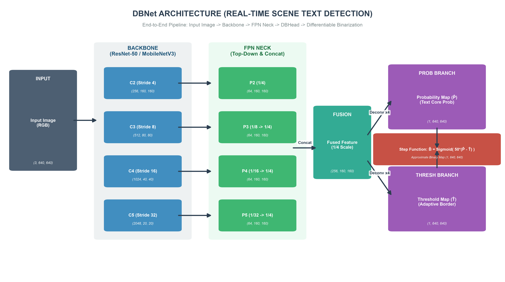
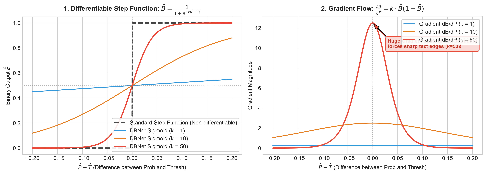
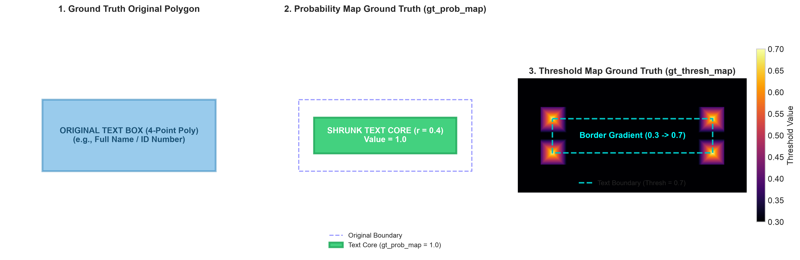

# 📖 DBNet Architecture: Real-Time Scene Text Detection with Differentiable Binarization

This technical document provides a comprehensive and detailed explanation of the **DBNet (Real-time Scene Text Detection with Differentiable Binarization)** architecture implemented in this repository for detecting structured text fields on Vietnamese Identity Cards (CCCD) and general document images.

---

## 1. End-to-End Architecture Overview

DBNet is a segmentation-based real-time text detector that integrates the binarization process directly into the neural network optimization loop. The overall pipeline consists of four major stages:



```
[Input Image (3, 640, 640)]
          │
          ▼
┌────────────────────────────────────────────────────────┐
│ 1. BACKBONE (ResNet-50 / MobileNetV3)                  │ ──► Extracts 4 multi-scale feature maps [C2, C3, C4, C5]
└────────────────────────────────────────────────────────┘
          │
          ▼
┌────────────────────────────────────────────────────────┐
│ 2. FPN NECK (Feature Pyramid Network & Fusion)         │ ──► Top-down lateral fusion and multi-scale concatenation (1/4 scale, 256 channels)
└────────────────────────────────────────────────────────┘
          │
          ▼
┌────────────────────────────────────────────────────────┐
│ 3. DBHEAD (Parallel Deconvolution Branches)            │ ──► 4x Upsampling to (1, 640, 640):
└────────────────────────────────────────────────────────┘       • Probability Map (P̂): Shrunk text core probability
          │                                                      • Threshold Map (T̂): Adaptive boundary threshold
          ▼
┌────────────────────────────────────────────────────────┐
│ 4. DIFFERENTIABLE BINARIZATION (Sigmoid k=50)          │ ──► Approximate Binary Map: B̂ = 1 / (1 + exp(-50*(P̂ - T̂)))
└────────────────────────────────────────────────────────┘
```

---

## 2. Mathematical Foundation: Differentiable Binarization

In traditional segmentation-based OCR methods, converting probability maps to binary text masks relies on a **fixed hard threshold** (e.g., $0.5$) using the standard non-differentiable step function:

$$B_{i, j} = \begin{cases} 1 & \text{if } P_{i, j} \ge T \\ 0 & \text{otherwise} \end{cases}$$

❌ **Limitations of Standard Binarization**:
* The standard step function is non-differentiable (zero gradient everywhere), making it impossible to co-optimize the threshold dynamically with the backbone.
* Hard thresholding fails on text lines in close proximity (such as the 3-line MRZ zone on ID cards) or varying illumination/shadows.

### 🌟 DBNet Breakthrough: Differentiable Step Function
DBNet replaces the non-differentiable step function with an amplified differentiable sigmoid approximation:

$$\hat{B}_{i, j} = \frac{1}{1 + \exp\left(-k \cdot (\hat{P}_{i, j} - \hat{T}_{i, j})\right)}$$

Where:
* $\hat{P}_{i, j}$: Predicted probability at pixel $(i, j)$ from the Probability branch.
* $\hat{T}_{i, j}$: Predicted adaptive threshold at pixel $(i, j)$ from the Threshold branch.
* $\hat{B}_{i, j}$: Approximate binary output used in the loss calculation.
* $k = 50$: Amplification factor (steepness scale).



### 📈 Why $k = 50$ is Optimal:
1. **Sharp Binary Transition**: At $k = 50$, the sigmoid function acts almost like a true binary step function, cleanly separating text from background.
2. **Extreme Gradient Flow at Text Boundaries**: The derivative with respect to $\hat{P}$:
   $$\frac{\partial \hat{B}}{\partial \hat{P}} = k \cdot \hat{B} (1 - \hat{B})$$
   creates an intense gradient spike when $\hat{P} \approx \hat{T}$. This forces the network to drastically penalize ambiguous boundary predictions and yield razor-sharp text contours.

---

## 3. Ground Truth Target Generation

During training, `DBTargetGenerator` converts 4-point quadrilateral polygons into multi-scale supervisory target maps:



### 1️⃣ Probability Map Target (`gt_prob_map`):
* Shrunk inwards by distance $D$ using the **Vatti Clipping Algorithm**:
  $$D = \frac{A \cdot (1 - r^2)}{L} \quad (r = 0.4)$$
  *(Where $A$ is the polygon area, $L$ is the perimeter, and $r = 0.4$ is the shrink ratio).*
* The internal core region is filled with **`1.0`**, background is **`0.0`**.

### 2️⃣ Threshold Map Target (`gt_thresh_map`):
* The polygon is dilated outwards by distance $+D$.
* For every pixel within the dilated band, the normalized Euclidean distance to the nearest polygon edge is computed and mapped to $[0.3 \rightarrow 0.7]$:
  * Distant background pixels = **`0.3`**.
  * Pixels exactly on the polygon boundary edge = **`0.7`**.

### 3️⃣ Threshold Mask (`gt_thresh_mask`):
* Binary mask marking only the dilated boundary region as **`1.0`** (pixels where Smooth L1 Loss is computed). Background pixels are **`0.0`** to eliminate extreme class imbalance.

---

## 4. Modular Codebase Architecture (`src/models/`)

### 🦴 4.1. Backbone Extractors ([`src/models/backbones/`](../src/models/backbones/))
* **`ResNet`** (`depth: 18, 34, 50, 101`): Extracts 4-stage multi-scale feature hierarchies $[C_2, C_3, C_4, C_5]$ corresponding to spatial strides $1/4, 1/8, 1/16, 1/32$.
* **`MobileNetV3`** (`arch: "large"`, `"small"`): Lightweight edge-optimized architecture utilizing Depthwise Separable Convolutions, Inverted Residual Blocks (MBConv), and Hard-Swish activations.
* **`TIMMBackbone`**: Universal adapter supporting SOTA vision models from `timm` (e.g., ConvNeXt, EfficientNet).
* **`frozen_stages`**: Parameter freezing mechanism (`frozen_stages: 1`) to lock early stem and stage layers for fast, stable fine-tuning.

### 🫁 4.2. Feature Pyramid Necks ([`src/models/necks/`](../src/models/necks/))
* **`FPN` (Feature Pyramid Network)**:
  1. $1 \times 1$ Lateral Convolutions project all backbone stages to a uniform 256 channels.
  2. Top-Down Feature Addition merges high-level semantics with fine spatial details.
  3. $3 \times 3$ Smooth Convolutions eliminate aliasing artifacts and reduce channels to $64$ per stage.
  4. Multi-scale Upsampling brings $P_3, P_4, P_5$ to the $1/4$ resolution of $P_2$, followed by channel concatenation to construct the unified **`Fused Feature Map`** $(256, H/4, W/4)$.
* **`ASF` (Adaptive Scale Fusion)**: Augments FPN with Spatial Attention to enhance text signals and suppress background document guilloche pattern noise.

### 🧠 4.3. Differentiable Prediction Head ([`src/models/heads/db_head.py`](../src/models/heads/db_head.py))
Two parallel deconvolution branches upsample the fused feature map from $1/4 \rightarrow 1/1$:
* **Probability Branch**: `Conv3x3 (256 -> 64) -> Deconv(x2) -> Deconv(x2) -> Sigmoid` $\rightarrow \hat{P} \in (1, H, W)$.
* **Threshold Branch**: `Conv3x3 (256 -> 64) -> Deconv(x2) -> Deconv(x2) -> Sigmoid` $\rightarrow \hat{T} \in (1, H, W)$.

---

## 5. Tensor Dimension Flow Table (For Input Size $640 \times 640$)

| Stage | Module Name | Stride | Output Channels | Output Tensor Dimension $(B, C, H, W)$ |
| :--- | :--- | :--- | :--- | :--- |
| **Input** | `image` | $1/1$ | $3$ | $(8, 3, 640, 640)$ |
| **Backbone** | $C_2$ (Stage 1) | $1/4$ | $256$ | $(8, 256, 160, 160)$ |
| | $C_3$ (Stage 2) | $1/8$ | $512$ | $(8, 512, 80, 80)$ |
| | $C_4$ (Stage 3) | $1/16$ | $1024$ | $(8, 1024, 40, 40)$ |
| | $C_5$ (Stage 4) | $1/32$ | $2048$ | $(8, 2048, 20, 20)$ |
| **Neck (FPN)** | $P_2, P_3, P_4, P_5$ | $1/4, 1/8, 1/16, 1/32$ | $64$ each | $(8, 64, H_i, W_i)$ |
| | `fused_feature` | $1/4$ | $256$ | $(8, 256, 160, 160)$ |
| **Head (DBHead)** | `prob_map` ($\hat{P}$) | $1/1$ | $1$ | $(8, 1, 640, 640)$ |
| | `thresh_map` ($\hat{T}$) | $1/1$ | $1$ | $(8, 1, 640, 640)$ |
| | `binary_map` ($\hat{B}$) | $1/1$ | $1$ | $(8, 1, 640, 640)$ |

---

## 6. Multi-Task Training Loss Formulation

The overall multi-task loss is a weighted sum of three loss components:

$$\mathcal{L} = \mathcal{L}_s(\hat{P}, Y) + \alpha \mathcal{L}_b(\hat{B}, Y) + \beta \mathcal{L}_t(\hat{T}, G)$$

Where:
* **$\mathcal{L}_s$ (Probability Map Loss)**: Binary Cross-Entropy (BCE) with Online Hard Example Mining (OHEM) maintaining a positive-to-negative ratio of $1 : 3$.
* **$\mathcal{L}_b$ (Binary Map Loss)**: Binary Cross-Entropy / Dice Loss comparing the approximate binary map $\hat{B}$ with ground truth core $Y$ ($\alpha = 1.0$).
* **$\mathcal{L}_t$ (Threshold Map Loss)**: Masked Smooth L1 Loss computed exclusively over the boundary region marked by `gt_thresh_mask` ($\beta = 10.0$):
  $$\mathcal{L}_t = \frac{\sum_{i \in \text{mask}} \text{SmoothL1}(\hat{T}_i - G_i)}{\sum_{i \in \text{mask}} 1}$$

---

## 7. Inference Post-Processing: Fast Polygon Extraction

During inference, DBNet is extremely fast because the threshold branch can be bypassed:

```
[Probability Map P̂] ──► Thresholding (P̂ > 0.3) ──► Find Contours ──► Vatti Unclip (r' = 1.5) ──► MinAreaRect / Quad Polygons
```

1. **Binarization**: Threshold $\hat{P}$ with a constant value (default: `thresh = 0.3`).
2. **Contour Extraction**: Extract connected components from the binary mask using OpenCV.
3. **Vatti Polygon Unclipping**: Expand the shrunk contours back to the original text box dimensions using offset distance $D'$:
   $$D' = \frac{A' \cdot r'}{L'} \quad (r' = 1.5)$$
   *(Where $A'$ and $L'$ are the contour area and perimeter, $r' = 1.5$ is the unclip expansion ratio).*
4. **Confidence Filtering**: Filter out bounding boxes whose mean pixel confidence within the polygon is below `box_thresh = 0.5`.
5. **Output Schema**: Returns accurate oriented 4-point quadrilateral polygons in the standardized project schema:
```json
[
  {
    "label": "text",
    "confidence": 0.9842,
    "polygon": [[214.25, 279.25], [379.75, 279.25], [379.75, 311.75], [214.25, 311.75]]
  }
]
```
*(Points are ordered clockwise: Top-Left, Top-Right, Bottom-Right, Bottom-Left, ready for direct perspective transformation).*

